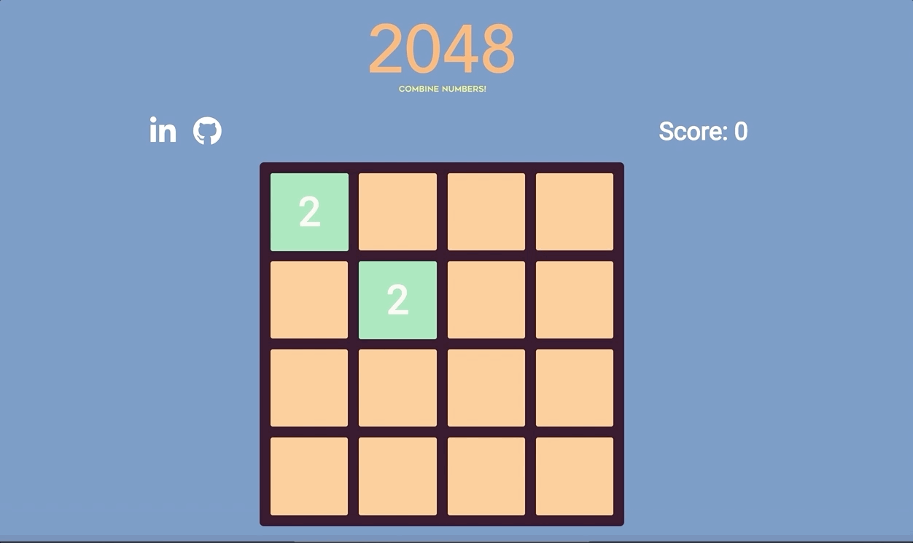

# 2048: Combine Numbers!

[Play here!](https://apolloskim.github.io/that-game-app/)

**Overview**

2048: *Combine Numbers!* is inspired by the original [2048](https://play2048.co/) game.

The objective is to slide numbered tiles on a grid to combine them to a create a new tile numbered 2048. The game will start with only two numbered tiles in random positions, and each will have a value of either 2 or 4.

Depending on which arrow key you press, the grid will slide to that direction. The tiles with the same number will merge, creating a new tile with double the number.

**How to Play**

There are four ways to move the tiles:

1. up arrow
2. down arrow
3. left arrow
4. right arrow

According to the direction of the arrow, the tiles will slide accordingly. After sliding, if the tiles that are adjacent to each other have the same number, they will merge to create a new tile with double the value. Once you create a new tile with the number 2048, you have won the game. The game will be over and you have lost if the grid is filled entirely with numbered tiles, none of which have any neighbor tiles with the same number.

**Languages Used**

HTML, CSS, and vanilla Javascript was used to create this game.
